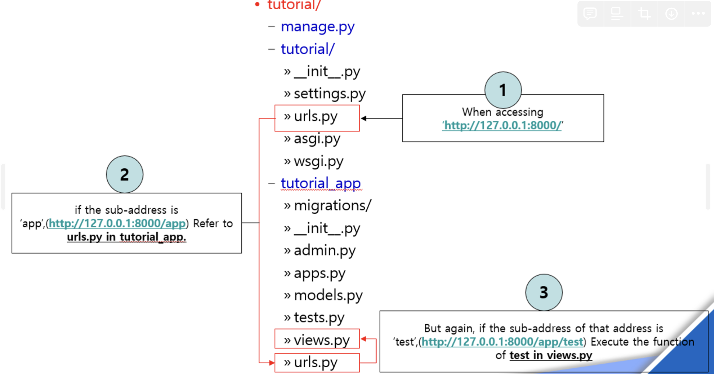
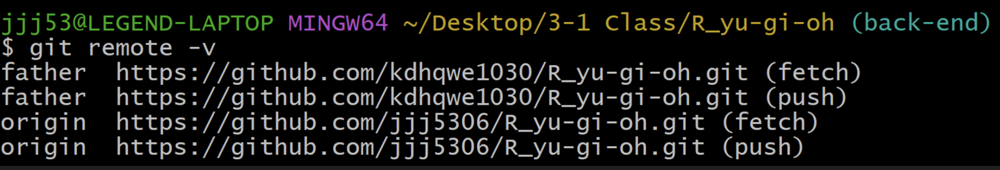
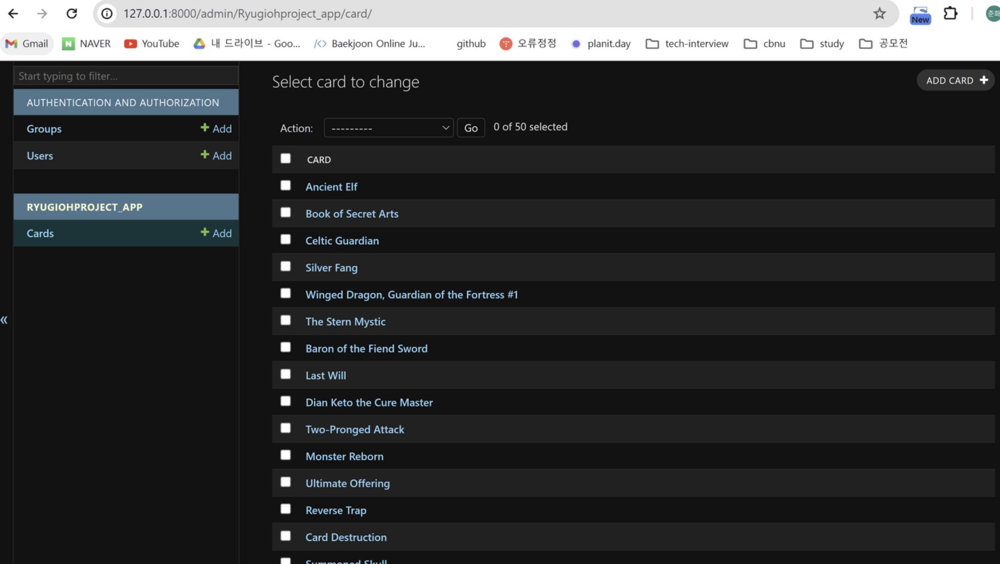

# 1. 환경 설정

```python
C:\Users\jjj53\anaconda3\Scripts\activate.bat

conda create -n "R_yu-gi-oh-project" python=3.7
conda activate "R_yu-gi-oh-project"
django-admin startproject Ryugiohproject
cd ./Ryugiohproject
python manage.py runserver
python manage.py startapp Ryugiohproject_app
```

Ryugiohproject/settings.py에 추가

```python
INSTALLED_APPS = [
    'django.contrib.admin',
    'django.contrib.auth',
    'django.contrib.contenttypes',
    'django.contrib.sessions',
    'django.contrib.messages',
    'django.contrib.staticfiles',
    'Ryugiohproject_app'
]
```

장고 프레임워크의 기본 구조는 아래와 같다.


Ryugiohproject/urls.py에서 url을 설정하고, Ryugiohproject_app/urls.py에서 해당 url 컨트롤러를 정의할 수 있다. 컨트롤러에서 뷰는 views.py에서 설정할 수 있다.

---

# 2. 패키지 구성

```python
Ryugiohproject/
    manage.py
    Ryugiohproject/
        __init__.py
        settings.py
        urls.py
        wsgi.py
    Ryugiohproject_app/
        __init__.py
        admin.py
        apps.py
        models.py
        tests.py
        views.py
        urls.py
    db.sqlite3
    requirements.txt
```

현재의 패키지 구성이다. 하나씩 살펴보자.

**1. `manage.py`**

기본 생성된 상태 그대로 둔다.

**2. `Ryugiohproject/` 폴더**

- **`__init__.py`**: 빈 파일로 두고, Python이 이 디렉터리를 패키지로 인식하는 역할을 한다.
- **`settings.py`**: Django 프로젝트의 설정 파일이다.

  - 코드 보기

    ```python
    """
    Django settings for Ryugiohproject project.

    Generated by 'django-admin startproject' using Django 3.2.25.

    For more information on this file, see
    https://docs.djangoproject.com/en/3.2/topics/settings/

    For the full list of settings and their values, see
    https://docs.djangoproject.com/en/3.2/ref/settings/
    """

    from pathlib import Path

    # Build paths inside the project like this: BASE_DIR / 'subdir'.
    BASE_DIR = Path(__file__).resolve().parent.parent

    # Quick-start development settings - unsuitable for production
    # See https://docs.djangoproject.com/en/3.2/howto/deployment/checklist/

    # SECURITY WARNING: keep the secret key used in production secret!
    SECRET_KEY = 'django-insecure-y^4so80urs-0)zpxi4p$!05i9t&-lhkv4_qm)$&j$a73y5d7v5'

    # SECURITY WARNING: don't run with debug turned on in production!
    DEBUG = True

    ALLOWED_HOSTS = []

    # Application definition

    INSTALLED_APPS = [
        'django.contrib.admin',
        'django.contrib.auth',
        'django.contrib.contenttypes',
        'django.contrib.sessions',
        'django.contrib.messages',
        'django.contrib.staticfiles',
        'Ryugiohproject_app'
    ]

    MIDDLEWARE = [
        'django.middleware.security.SecurityMiddleware',
        'django.contrib.sessions.middleware.SessionMiddleware',
        'django.middleware.common.CommonMiddleware',
        'django.middleware.csrf.CsrfViewMiddleware',
        'django.contrib.auth.middleware.AuthenticationMiddleware',
        'django.contrib.messages.middleware.MessageMiddleware',
        'django.middleware.clickjacking.XFrameOptionsMiddleware',
    ]

    ROOT_URLCONF = 'Ryugiohproject.urls'

    TEMPLATES = [
        {
            'BACKEND': 'django.template.backends.django.DjangoTemplates',
            'DIRS': [],
            'APP_DIRS': True,
            'OPTIONS': {
                'context_processors': [
                    'django.template.context_processors.debug',
                    'django.template.context_processors.request',
                    'django.contrib.auth.context_processors.auth',
                    'django.contrib.messages.context_processors.messages',
                ],
            },
        },
    ]

    WSGI_APPLICATION = 'Ryugiohproject.wsgi.application'

    # Database
    # https://docs.djangoproject.com/en/3.2/ref/settings/#databases

    DATABASES = {
        'default': {
            'ENGINE': 'django.db.backends.sqlite3',
            'NAME': BASE_DIR / 'db.sqlite3',
        }
    }

    # Password validation
    # https://docs.djangoproject.com/en/3.2/ref/settings/#auth-password-validators

    AUTH_PASSWORD_VALIDATORS = [
        {
            'NAME': 'django.contrib.auth.password_validation.UserAttributeSimilarityValidator',
        },
        {
            'NAME': 'django.contrib.auth.password_validation.MinimumLengthValidator',
        },
        {
            'NAME': 'django.contrib.auth.password_validation.CommonPasswordValidator',
        },
        {
            'NAME': 'django.contrib.auth.password_validation.NumericPasswordValidator',
        },
    ]

    # Internationalization
    # https://docs.djangoproject.com/en/3.2/topics/i18n/

    LANGUAGE_CODE = 'en-us'

    TIME_ZONE = 'UTC'

    USE_I18N = True

    USE_L10N = True

    USE_TZ = True

    # Static files (CSS, JavaScript, Images)
    # https://docs.djangoproject.com/en/3.2/howto/static-files/

    STATIC_URL = '/static/'

    # Default primary key field type
    # https://docs.djangoproject.com/en/3.2/ref/settings/#default-auto-field

    DEFAULT_AUTO_FIELD = 'django.db.models.BigAutoField'
    ```

- **`urls.py`**: URL 라우팅을 정의하는 파일입니다.

  ```python
  """Ryugiohproject URL Configuration

  The `urlpatterns` list routes URLs to views. For more information please see:
      https://docs.djangoproject.com/en/3.2/topics/http/urls/
  Examples:
  Function views
      1. Add an import:  from my_app import views
      2. Add a URL to urlpatterns:  path('', views.home, name='home')
  Class-based views
      1. Add an import:  from other_app.views import Home
      2. Add a URL to urlpatterns:  path('', Home.as_view(), name='home')
  Including another URLconf
      1. Import the include() function: from django.urls import include, path
      2. Add a URL to urlpatterns:  path('blog/', include('blog.urls'))
  """
  from django.contrib import admin
  from django.urls import path

  urlpatterns = [
      path('admin/', admin.site.urls),
  ]
  ```

- **`wsgi.py`**: WSGI 호환 웹 서버에서 이 Django 프로젝트를 사용할 수 있도록 설정하는 파일이다. 초기 상태로 두면 된다.

**3.** `Ryugiohproject_app` **폴더**

앱은 프로젝트 내에서 특정 기능을 담당하는 단위이다.

- **`__init__.py`**: 빈 파일로 두면 되고, Python이 이 디렉터리를 패키지로 인식하도록 한다.
- **`admin.py`**: 관리자 페이지에 모델을 등록하는 파일이다.

  ```python
  from django.contrib import admin

  # Register your models here.
  ```

- **`apps.py`**: 앱의 설정을 정의하는 파일이다.

  ```python
  from django.apps import AppConfig

  class RyugiohprojectAppConfig(AppConfig):
      default_auto_field = 'django.db.models.BigAutoField'
      name = 'Ryugiohproject_app'
  ```

- **`models.py`**: 데이터베이스 모델을 정의하는 파일이다.

  ```python
  from django.db import models

  # Create your models here.
  ```

- **`tests.py`**: 테스트 케이스를 작성하는 파일이다.

  ```python
  from django.test import TestCase

  # Create your tests here.
  ```

- **`views.py`**: 뷰를 정의하는 파일이다.

  ```python
  from django.shortcuts import render

  # Create your views here.
  ```

- **`urls.py`**: 앱의 URL 라우팅을 정의하는 파일이다. 이 파일은 수동으로 생성해야 한다.

  ```python
  from django.urls import path
  from . import views

  urlpatterns = [
      path('', views.index, name='index'),
  ]
  ```

**4. `db.sqlite3`**

SQLite 데이터베이스 파일로, 기본 설정에서는 자동으로 생성된다.

---

# 3. git 사용법 정리

## 1. fork

원본 리파지토리를 fork하여 내 리파지토리로 따온다.

https://github.com/jjj5306/R_yu-gi-oh

fork를 사용하면 팀원들과 공유하는 리파지토리가 아닌, 나만의 리포지토리가 생긴다.

## 2. clone + remote

fork 딴 리포지토리를 clone하고 remote 설정은 원본 리파지토리와 fork 리파지토리 둘 다 설정한다.



## 3.개발

기본적인 개발 단계는 다음과 같다.

1. 이슈 생성

   - 정해진 규칙에 따라 이슈를 생성한다. 이번 프로젝트의 이슈 생성 규칙은 다음과 같다.

   ```markdown
   ## Description for development features

   DB의 특정 칼럼을 JSON으로 뷰에 넘겨주고 모델에 card set 추가

   ## Todo-lists

   - [ ] 삼환신, 엑조디아, 궁극의 푸른 눈의 백룡 웰컴 페이지로 넘겨주기
   - [ ] 등장인물 별 덱을 보여주기 위해 모델에 card set 추가 및 DB 연동
   ```

2. 생성한 이슈와 관련된 기능을 개발할 브런치를 생성한다.
3. 생성한 브랜치에서 작업한다.
4. add + commit + pull + push
   - push 전에 pull을 해두는 습관이 좋다.

## 4. pull request

push하고 나면 github에서 pull request를 생성할 수 있다. pull request의 규칙은 다음과 같다.

```markdown
## 제목 :

feat(issue 번호): 기능명

## 🔎 작업 내용

기능에서 어떤 부분이 구현되었는지 설명해주세요

  <br/>

## 이미지 첨부


<br/>

## 🔧 앞으로의 과제

  <br/>
```

이렇게 pr을 날리고 나면 관리자가 원본 리파지토리에서 merge할 수 있다. 그제서야 적용이 되는 것이다.

---

# 4. 메인 화면 만들기 with nodohyun

모델을 넘기는 동적 페이지를 보여주는 예시를 한 번 짜보았다.

`Ryugiohproject/urls.py`

```python
from django.contrib import admin
from django.urls import path, include

urlpatterns = [
    path('admin/', admin.site.urls),
    path('', include('Ryugiohproject_app.urls')),
]
```

`Ryugiohproject/models.py`

```python
from django.db import models

# Create your models here.

class Card(models.Model):
    name = models.CharField(max_length=100)
    description = models.TextField()
    attack_points = models.IntegerField()
    defense_points = models.IntegerField()

    def __str__(self):
        return self.name
```

`Ryugiohproject/Ryugiohproject_app/templates/index`

- 코드 보기

  ```python
  <!DOCTYPE html>
  <html lang="en">
    <head>
      
      <meta charset="UTF-8" />
      <meta name="viewport" content="width=device-width, initial-scale=1.0" />
      <title>Document</title>
      <style>
        html,
        body {
          height: 100%;
          margin: 0;
          background-color: black;
          scroll-behavior: smooth;
        }

        header {
          height: 64px;
          width: 100%;
          position: fixed;
          top: 0;
          z-index: 100;
          color: white;
          display: flex;
          justify-content: space-between;
          align-items: center;
        }
        .left-header {
          list-style: none;
          display: flex;
          margin-left: 10%;
        }
        .right-header {
          list-style: none;
          display: flex;
          margin-right: 10%;
        }
        li {
          margin: 5px 25px;
        }
        .bg-video {
          width: 100%;
          background-attachment: fixed;
        }
        .parent_div {
          margin-left: auto;
          margin-right: auto;
          margin-top: 1000px;
          width: 500px;
          height: 500px;
          background-color: red;
          box-shadow: 4px 4px 4px 3px rgba(0, 0, 0, 0.4);
        }
        .child_div {
          margin: 0% auto;
          width: 300px;
          height: 300px;
          background-color: blue;
        }
      </style>
    </head>
    <body>
      <header>
        <ul class="left-header">
          <li>홈 화면</li>
          <li>카드 보기</li>
          <li>카드 보기</li>
        </ul>
        <ul class="right-header">
          <li>로그인</li>
          <li>좋아요</li>
          <li>내 정보</li>
        </ul>
      </header>
      <div class="bg-video">
        <video class="bg-video__content" autoplay muted loop>
          <source src="" type="video/mp4" />
        </video>
      </div>
      <div class="parent_div">
        <div class="child_div"></div>
      </div>
    </body>
  </html>

  ```

`Ryugiohproject/Ryugiohproject_app/views.py`

```python
from django.shortcuts import render
from .models import Card

# Create your views here.

def index(request):
    cards = Card.objects.all()
    return render(request, 'index.html', {'cards': cards})
```

`Ryugiohproject/settings.py` 아래 내용 추가(static 컨텐츠)

```python
STATIC_URL = '/static/'

STATICFILES_DIRS = [
    os.path.join(BASE_DIR, 'static'),
]
```

video.mp4를 보여주기 위해 프로젝트 최상단에 static 디렉터리 생성 후 video.mp4를 옮김

```python
Ryugiohproject/
    Ryugiohproject_app/
    Ryugiohproject/
    static/
        video.mp4
    manage.py
```

## 서버 키고 테스트하기


```python
python manage.py makemigrations
python manage.py migrate
python manage.py runserver
```

모델 생성 후 마이그레이션을 생성하고 적용해야 한다.

index.html을 그냥 열었을 때와는 해상도나 크기가 좀 달라서 수정이 필요하다.

---

# 5. API로 CardInfo JSON으로 받아서 DB에 저장하기

먼저 JSON으로 받아와서, 파싱하는 것 까지 해봤다. view에 출력하는 방식으로 테스트했다.

Ryugiohproject_app/views.py

```python
import requests
from django.http import JsonResponse
from django.shortcuts import render
from .models import Card

# Main page view
def index(request):
    cards = Card.objects.all()
    return render(request, 'index.html', {'cards': cards})

# API data fetching view
def cardinfo(request):
    url = 'https://db.ygoprodeck.com/api/v7/cardinfo.php?cardset=Starter%20Deck:%20Yugi'
    response = requests.get(url)
    if response.status_code == 200:
        data = response.json()
        if 'data' in data:
            cards = data['data']
            filtered_cards = []
            for card in cards:
                filtered_card = {
                    'id': card.get('id'),
                    'name': card.get('name'),
                    'type': card.get('type'),
                    'frameType': card.get('frameType'),
                    'desc': card.get('desc'),
                    'atk': card.get('atk'),
                    'def': card.get('def'),
                    'level': card.get('level'),
                    'race': card.get('race'),
                    'attribute': card.get('attribute'),
                    'card_images': card.get('card_images'),
                    'card_prices': card.get('card_prices'),
                }
                filtered_cards.append(filtered_card)
            return JsonResponse(filtered_cards, safe=False)
        else:
            return JsonResponse({'error': 'Invalid data format'}, status=500)
    else:
        return JsonResponse({'error': 'Failed to retrieve data'}, status=response.status_code)

```

파이썬에서는 request를 사용하여 HTTP 요청을 보내고, 응답을 받아올 수 있다. 파싱 또한 상당히 쉽다.

Ryugiohproject_app/views.py를 다음과 같이 세팅하여 위의 코드의 실행을 볼 수 있다.

```python
from django.urls import path
from . import views

urlpatterns = [
    path('', views.index, name='index'),
    path('cardinfo/', views.cardinfo, name='cardinfo'),
]

```

## DB 스키마 정의

Django의 마이그레이션 시스템은 모델 변경 사항을 데이터베이스 스키마에 반영하는 도구이다. 모델을 정의하고 마이그레이션을 생성 및 적용하면, 데이터베이스에 해당하는 테이블이 자동으로 생성된다.

models.py

```python
from django.db import models

# Create your models here.

class Card(models.Model):
    name = models.CharField(max_length=100)
    type = models.CharField(max_length=100, default='Normal')  # 기본값 추가
    frameType = models.CharField(max_length=100, null=True, blank=True)
    desc = models.TextField()
    atk = models.IntegerField(null=True, blank=True)
    defense = models.IntegerField(null=True, blank=True)  # 'def' 대신 'defense' 사용
    level = models.IntegerField(null=True, blank=True)
    race = models.CharField(max_length=100, default='Dragon')  # 기본값 추가
    attribute = models.CharField(max_length=100, null=True, blank=True)
    card_images = models.JSONField(null=True, blank=True)
    card_prices = models.JSONField(null=True, blank=True)

    def __str__(self):
        return self.name

```

이렇게 모델을 정의한 후 makemigrations 명령어를 실행하여 마이그레이션 파일을 생성할 수 있다.

```python
python manage.py makemigrations
```

생성된 마이그레이션 파일을 적용하면 데이터 베이스에 모델의 변경 사항이 반영된다. 즉, `Card` 모델에 대응하는 데이터베이스 테이블이 자동으로 생성되는 것이다.

```python
python manage.py migrate
```

## API로 받은 JSON 데이터를 DB에 저장하기

views.py

```python
import requests
from django.http import JsonResponse
from django.shortcuts import render
from .models import Card
from django.db import transaction

# Main page view
def index(request):
    cards = Card.objects.all()
    return render(request, 'index.html', {'cards': cards})

def cardinfo(request):
    url = 'https://db.ygoprodeck.com/api/v7/cardinfo.php?cardset=Starter%20Deck:%20Yugi'
    response = requests.get(url)
    if response.status_code == 200:
        data = response.json()
        if 'data' in data:
            cards = data['data']
            with transaction.atomic():
                for card in cards:
                    Card.objects.update_or_create(
                        id=card.get('id'),
                        defaults={
                            'name': card.get('name'),
                            'type': card.get('type'),
                            'frameType': card.get('frameType'),
                            'desc': card.get('desc'),
                            'atk': card.get('atk'),
                            'defense': card.get('def'),
                            'level': card.get('level'),
                            'race': card.get('race'),
                            'attribute': card.get('attribute'),
                            'card_images': card.get('card_images'),
                            'card_prices': card.get('card_prices'),
                        }
                    )
            return JsonResponse({'message': 'Data successfully saved to database'}, status=200)
        else:
            return JsonResponse({'error': 'Invalid data format'}, status=500)
    else:
        return JsonResponse({'error': 'Failed to retrieve data'}, status=response.status_code)

```

코드를 하나씩 뜯어보자.

```python
def cardinfo(request):
    url = 'https://db.ygoprodeck.com/api/v7/cardinfo.php?cardset=Starter%20Deck:%20Yugi'
    response = requests.get(url)
    if response.status_code == 200:
        data = response.json()
```

- 외부 API에 GET 요청을 보내서 JSON 형식으로 응답을 파싱한다.

```python
    if 'data' in data:
        cards = data['data']
        with transaction.atomic():

```

- `transaction.atomic()` 을 사용하여 데이터베이스 트랙잭션을 시작한다. 이렇게 하면 DB의 작업이 성공적으로 완료되지 않으면 모든 작업이 롤백된다.

```python
                for card in cards:
                    Card.objects.update_or_create(
                        id=card.get('id'),
                        defaults={
                            'name': card.get('name'),
                            'type': card.get('type'),
                            'frameType': card.get('frameType'),
                            'desc': card.get('desc'),
                            'atk': card.get('atk'),
                            'defense': card.get('def'),  # JSON 데이터의 'def' 필드를 'defense' 필드로 매핑
                            'level': card.get('level'),
                            'race': card.get('race'),
                            'attribute': card.get('attribute'),
                            'card_images': card.get('card_images'),
                            'card_prices': card.get('card_prices'),
                        }
                    )

```

- `Card.objects.undate_or_create` : 첫 번째 파라미터를 primaryKey로 하여 Card를 모델로 사용하는 Database에 데이터를 업데이트하거나 새로운 레코드를 생성할 수 있다.

이렇게 DB 생성 및 데이터 삽입을 마쳤다.

💡 참고) 생성된 DB의 확인은 admin 계정을 생성하고, admin url로 접속하여 확인할 수 있다.



그런데 views.py에서 DB의 삽입이 이루어 지는 것은 옳지 않다. 재사용성 측면과 SRP 원칙, 유지 보수의 측면에서 DB와 관련된 작업은 서비스 계층에서 이루어지는 편이 좋아보인다. 따라서 `services.py` 를 정의하고, 해당 파일에서 데이터를 처리하는 방식으로 리팩토링했다.

services.py

```python
# Ryugiohproject_app/services.py

import requests
from .models import Card
from django.db import transaction

class CardService:

    @staticmethod
    def fetch_and_save_card_data():
        url = 'https://db.ygoprodeck.com/api/v7/cardinfo.php?cardset=Starter%20Deck:%20Yugi'
        response = requests.get(url)
        if response.status_code == 200:
            data = response.json()
            if 'data' in data:
                cards = data['data']
                with transaction.atomic():
                    for card in cards:
                        Card.objects.update_or_create(
                            id=card.get('id'),
                            defaults={
                                'name': card.get('name'),
                                'type': card.get('type'),
                                'frameType': card.get('frameType'),
                                'desc': card.get('desc'),
                                'atk': card.get('atk'),
                                'defense': card.get('def'),
                                'level': card.get('level'),
                                'race': card.get('race'),
                                'attribute': card.get('attribute'),
                                'card_images': card.get('card_images'),
                                'card_prices': card.get('card_prices'),
                            }
                        )
                return {'message': 'Data successfully saved to database'}
            else:
                return {'error': 'Invalid data format'}
        else:
            return {'error': f'Failed to retrieve data: {response.status_code}'}

```

그리고 `CardService.fetch_and_save_card_data()` 메서드를 사용해서 DB에 데이터를 받아올 수 있다.

---

# 6. DB 채우기 및 중복 제거

```python
# Ryugiohproject_app/services.py

import requests
from .models import Card
from django.db import transaction

class CardService:

    @staticmethod
    def fetch_and_save_card_data():
        urls = [
            'https://db.ygoprodeck.com/api/v7/cardinfo.php?cardset=Starter%20Deck:%20Yugi',
            'https://db.ygoprodeck.com/api/v7/cardinfo.php?cardset=Starter%20Deck:%20Kaiba',
            'https://db.ygoprodeck.com/api/v7/cardinfo.php?cardset=Starter%20Deck:%20Joey',
            'https://db.ygoprodeck.com/api/v7/cardinfo.php?cardset=Starter%20Deck:%20Pegasus',
            'https://db.ygoprodeck.com/api/v7/cardinfo.php?name=Obelisk%20the%20Tormentor',
            'https://db.ygoprodeck.com/api/v7/cardinfo.php?name=Slifer%20the%20Sky%20Dragon',
            'https://db.ygoprodeck.com/api/v7/cardinfo.php?name=The%20Winged%20Dragon%20of%20Ra',
            'https://db.ygoprodeck.com/api/v7/cardinfo.php?name=Exodia%20the%20Forbidden%20One',
            'https://db.ygoprodeck.com/api/v7/cardinfo.php?name=Left%20Arm%20of%20the%20Forbidden%20One',
            'https://db.ygoprodeck.com/api/v7/cardinfo.php?name=Left%20Leg%20of%20the%20Forbidden%20One',
            'https://db.ygoprodeck.com/api/v7/cardinfo.php?name=Right%20Leg%20of%20the%20Forbidden%20One',
            'https://db.ygoprodeck.com/api/v7/cardinfo.php?name=Blue-Eyes%20Ultimate%20Dragon',
        ]

        all_cards = []

        # Fetch data from all URLs
        for url in urls:
            response = requests.get(url)
            if response.status_code == 200:
                data = response.json()
                if 'data' in data:
                    all_cards.extend(data['data'])
                else:
                    return {'error': f'Invalid data format from {url}'}
            else:
                return {'error': f'Failed to retrieve data from {url}: {response.status_code}'}

        # Save all card data to the database
        with transaction.atomic():
            for card in all_cards:
                Card.objects.update_or_create(
                    id=card.get('id'),
                    defaults={
                        'name': card.get('name'),
                        'type': card.get('type'),
                        'frameType': card.get('frameType'),
                        'desc': card.get('desc'),
                        'atk': card.get('atk'),
                        'defense': card.get('def'),
                        'level': card.get('level'),
                        'race': card.get('race'),
                        'attribute': card.get('attribute'),
                        'card_images': card.get('card_images'),
                        'card_prices': card.get('card_prices'),
                    }
                )

        return {'message': 'Data successfully saved to database'}

```

이렇게 각 스타터 덱과 궁극의 푸른 눈의 백룡 엑조디아, 삼환신을 DB에 추가했다.

후자의 세 카드를 따로 추가한 이유는 메인 페이지에서 이 카드들을 보여주고 메뉴 바를 통해 스타터 덱을 보기 위함이다.

구현 부분에서는 기존과 거의 똑같은데 url, response가 굉장히 많아진만큼 리스트를 사용해서 리팩토링했다.

문제점을 찾았는데, 현재 방식은 `/cardinfo` url로 접근할 때 마다 DB에 API 데이터를 중복해서 추가한다. api가 더 이상 업데이트 되지도 않고 따로 관리자 페이지를 만들지 않을 예정이라 해당 방식이 아닌 관리 커맨드로 DB를 초기화한 뒤 API 데이터를 추가하는 방식으로 변경했다.

```python
# Ryugiohproject_app/management/commands/load_cards.py

from django.core.management.base import BaseCommand
from Ryugiohproject_app.services import CardService
from Ryugiohproject_app.models import Card

class Command(BaseCommand):
    help = 'Load cards from external API and save to database'

    def handle(self, *args, **kwargs):
        # 기존 데이터를 삭제
        self.stdout.write('Deleting existing card data...')
        Card.objects.all().delete()

        # 새로운 데이터를 가져와서 저장
        result = CardService.fetch_and_save_card_data()
        if 'message' in result:
            self.stdout.write(self.style.SUCCESS(result['message']))
        else:
            self.stdout.write(self.style.ERROR(result['error']))

```

위의 방식으로 관리 커맨드를 생성할 수 있고, `python manage.py load_cards` 이렇게 관리 커맨드를 호출할 수 있다.

이제 구현할 사항은 다음과 같다.

1. 스타터 덱을 기준으로 api를 받아오다 보니, 중복된 카드들이 많다. 중복된 카드를 제거해야 한다.
2. 현재 이미지가 DB에 저장되는 방식은 다음과 같다.

   ```python
   {
     "id": 23995346,
     "image_url": "https://images.ygoprodeck.com/images/cards/23995346.jpg",
     "image_url_small": "https://images.ygoprodeck.com/images/cards_small/23995346.jpg",
     "image_url_cropped": "https://images.ygoprodeck.com/images/cards_cropped/23995346.jpg"
   },
   {
     "id": 23995347,
     "image_url": "https://images.ygoprodeck.com/images/cards/23995347.jpg",
     "image_url_small": "https://images.ygoprodeck.com/images/cards_small/23995347.jpg",
     "image_url_cropped": "https://images.ygoprodeck.com/images/cards_cropped/23995347.jpg"
   },
   {
     "id": 23995348,
     "image_url": "https://images.ygoprodeck.com/images/cards/23995348.jpg",
     "image_url_small": "https://images.ygoprodeck.com/images/cards_small/23995348.jpg",
     "image_url_cropped": "https://images.ygoprodeck.com/images/cards_cropped/23995348.jpg"
   }
   ```

   거의 모든 엔티티가 이미지 소스가 여러개 존재해서 이 부분 처리가 필요하다.

   **즉, 이미지 소스 하나를 선택해서 출력을 하던, 로컬에 저장을 하던, 방식을 고민하고 구현해야 한다.**

3. 메인 페이지에서 엑조디아 5종류, 궁극의 푸른 눈의 백룡, 삼환신을 보여줘야 한다. 해당 부분을 json으로 프론트에서 보여줘야 하기에 셀렉트문과 index.html에 json으로 넘겨주는 방식을 구현해야 한다.
4. 스타터 덱을 보여주려면 미리 유희의 스타더 덱 id list를 정의해놓던가(하드코딩), api의 card_set을 사용하던가 해야한다. 이 부분도 고민이 필요하다.
5. 뷰에서 메뉴 버튼을 눌렀을 때 다른 화면으로 넘어가는 url 매핑 방식과 url을 고민해야 한다. 아마 GET 쿼리문으로 작성할 것 같다.
6. 회원 가입, 로그인, 마이 페이지, 좋아요 기능을 구현해야 한다.

## 중복 제거하기

카드의 중복을 제거하는 방법은 크게 2가지가 떠오른다.

1. 삽입 시 검색을 통해 삭제하기
   - 검색이 어떻게 이루어지는지 모르겠지만 O(n)으로 구현되어 있더라도 O(n^2)이 든다. → 기각
2. 정렬 후 삭제하기
   - 시간 복잡도는 정렬에 O(nlog n), 삭제에 O(n)이므로 O(nlog n)이다. 그리고 데이터를 정렬해도 상관 없으므로 이렇게 구현하였다.

```python
import requests
from .models import Card
from django.db import transaction
import logging

logger = logging.getLogger(__name__)

class CardService:

    @staticmethod
    def fetch_and_save_card_data():
        urls = [
            'https://db.ygoprodeck.com/api/v7/cardinfo.php?cardset=Starter%20Deck:%20Yugi',
            'https://db.ygoprodeck.com/api/v7/cardinfo.php?cardset=Starter%20Deck:%20Kaiba',
            'https://db.ygoprodeck.com/api/v7/cardinfo.php?cardset=Starter%20Deck:%20Joey',
            'https://db.ygoprodeck.com/api/v7/cardinfo.php?cardset=Starter%20Deck:%20Pegasus',
            'https://db.ygoprodeck.com/api/v7/cardinfo.php?name=Obelisk%20the%20Tormentor',
            'https://db.ygoprodeck.com/api/v7/cardinfo.php?name=Slifer%20the%20Sky%20Dragon',
            'https://db.ygoprodeck.com/api/v7/cardinfo.php?name=The%20Winged%20Dragon%20of%20Ra',
            'https://db.ygoprodeck.com/api/v7/cardinfo.php?name=Exodia%20the%20Forbidden%20One',
            'https://db.ygoprodeck.com/api/v7/cardinfo.php?name=Left%20Arm%20of%20the%20Forbidden%20One',
            'https://db.ygoprodeck.com/api/v7/cardinfo.php?name=Left%20Leg%20of%20the%20Forbidden%20One',
            'https://db.ygoprodeck.com/api/v7/cardinfo.php?name=Right%20Leg%20of%20the%20Forbidden%20One',
        ]

        all_cards = []

        # Fetch data from all URLs
        for url in urls:
            response = requests.get(url)
            if response.status_code == 200:
                data = response.json()
                if 'data' in data:
                    all_cards.extend(data['data'])
                else:
                    error_message = f'Invalid data format from {url}'
                    logger.error(error_message)
                    return {'error': error_message}
            else:
                error_message = f'Failed to retrieve data from {url}: {response.status_code}'
                logger.error(error_message)
                return {'error': error_message}

        # Sort the cards by id and remove duplicates
        all_cards.sort(key=lambda card: card['id'])
        unique_cards = []
        last_id = None
        for card in all_cards:
            if card['id'] != last_id:
                unique_cards.append(card)
                last_id = card['id']

        # Save all unique card data to the database
        try:
            with transaction.atomic():
                for card in unique_cards:
                    Card.objects.update_or_create(
                        id=card.get('id'),
                        defaults={
                            'name': card.get('name'),
                            'type': card.get('type'),
                            'frameType': card.get('frameType'),
                            'desc': card.get('desc'),
                            'atk': card.get('atk'),
                            'defense': card.get('def'),
                            'level': card.get('level'),
                            'race': card.get('race'),
                            'attribute': card.get('attribute'),
                            'card_images': card.get('card_images'),
                            'card_prices': card.get('card_prices'),
                        }
                    )
            return {'message': 'Data successfully saved to database'}
        except Exception as e:
            logger.error(f'Error saving data to the database: {e}')
            return {'error': 'Error saving data to the database'}

```

핵심 로직은 다음과 같다.

```python
 all_cards.sort(key=lambda card: card['id'])
        unique_cards = []
        last_id = None
        for card in all_cards:
            if card['id'] != last_id:
                unique_cards.append(card)
                last_id = card['id']
```

id를 기준으로 정렬하고, last_id를 사용해서 삭제하는 방식이다.

---

# 7. 이미지 URL 파싱

위에서 말한 문제 중 이미지 여러 개가 API 데이터로 삽입되어 있는 문제를 해결했다. 여러 url들을 분석해보니 큰 차이가 없어서 그냥 가장 처음 나오는 데이터를 DB에 삽입했다.

```python
import requests
from .models import Card
from django.db import transaction
import logging

logger = logging.getLogger(__name__)

class CardService:

    @staticmethod
    def fetch_and_save_card_data():
        urls = [
            'https://db.ygoprodeck.com/api/v7/cardinfo.php?cardset=Starter%20Deck:%20Yugi',
            'https://db.ygoprodeck.com/api/v7/cardinfo.php?cardset=Starter%20Deck:%20Kaiba',
            'https://db.ygoprodeck.com/api/v7/cardinfo.php?cardset=Starter%20Deck:%20Joey',
            'https://db.ygoprodeck.com/api/v7/cardinfo.php?cardset=Starter%20Deck:%20Pegasus',
            'https://db.ygoprodeck.com/api/v7/cardinfo.php?name=Obelisk%20the%20Tormentor',
            'https://db.ygoprodeck.com/api/v7/cardinfo.php?name=Slifer%20the%20Sky%20Dragon',
            'https://db.ygoprodeck.com/api/v7/cardinfo.php?name=The%20Winged%20Dragon%20of%20Ra',
            'https://db.ygoprodeck.com/api/v7/cardinfo.php?name=Exodia%20the%20Forbidden%20One',
            'https://db.ygoprodeck.com/api/v7/cardinfo.php?name=Left%20Arm%20of%20the%20Forbidden%20One',
            'https://db.ygoprodeck.com/api/v7/cardinfo.php?name=Left%20Leg%20of%20the%20Forbidden%20One',
            'https://db.ygoprodeck.com/api/v7/cardinfo.php?name=Right%20Leg%20of%20the%20Forbidden%20One',
        ]

        all_cards = []

        # Fetch data from all URLs
        for url in urls:
            response = requests.get(url)
            if response.status_code == 200:
                data = response.json()
                if 'data' in data:
                    all_cards.extend(data['data'])
                else:
                    error_message = f'Invalid data format from {url}'
                    logger.error(error_message)
                    return {'error': error_message}
            else:
                error_message = f'Failed to retrieve data from {url}: {response.status_code}'
                logger.error(error_message)
                return {'error': error_message}

        # Sort the cards by id and remove duplicates
        all_cards.sort(key=lambda card: card['id'])
        unique_cards = []
        last_id = None
        for card in all_cards:
            if card['id'] != last_id:
                unique_cards.append(card)
                last_id = card['id']

        # Save all unique card data to the database
        try:
            with transaction.atomic():
                for card in unique_cards:
                    # Get the first image URL
                    image_url = card['card_images'][0]['image_url'] if card['card_images'] else None

                    Card.objects.update_or_create(
                        id=card.get('id'),
                        defaults={
                            'name': card.get('name'),
                            'type': card.get('type'),
                            'frameType': card.get('frameType'),
                            'desc': card.get('desc'),
                            'atk': card.get('atk'),
                            'defense': card.get('def'),
                            'level': card.get('level'),
                            'race': card.get('race'),
                            'attribute': card.get('attribute'),
                            'card_images': image_url,
                            'card_prices': card.get('card_prices'),
                        }
                    )
            return {'message': 'Data successfully saved to database'}
        except Exception as e:
            logger.error(f'Error saving data to the database: {e}')
            return {'error': 'Error saving data to the database'}

```

## 뷰로 데이터 넘겨주기

이번에 구현할 부분은 `http://127.0.0.1:8000/` 로 접속하면 웰컴페이지가 나오면서 거기서 삼환신과 엑조디아 시리즈, 궁극의 푸른눈의 백룡 카드를 출력하는 부분이다.

순수 JS에서 데이터를 출력하는 방식은 주로 JSON을 사용한다고 한다. 또, JS에서 `http://127.0.0.1:8000/?ids=` 로 요청을 보내고, 응답으로 해당 카드의 리턴을 받아서 출력할 수 있다. 스프링을 사용했을 때는 프론트도 템플릿 엔진을 써서 전혀 다른 방식이었는데 JSON으로 다루는건 처음이다.

## CardSet 설정

```python
import requests
from .models import Card, CardSet
from django.db import transaction
import logging

logger = logging.getLogger(__name__)

class CardService:

    @staticmethod
    def fetch_and_save_card_data():
        urls = [
            'https://db.ygoprodeck.com/api/v7/cardinfo.php?cardset=Starter%20Deck:%20Yugi',
            'https://db.ygoprodeck.com/api/v7/cardinfo.php?cardset=Starter%20Deck:%20Kaiba',
            'https://db.ygoprodeck.com/api/v7/cardinfo.php?cardset=Starter%20Deck:%20Joey',
            'https://db.ygoprodeck.com/api/v7/cardinfo.php?cardset=Starter%20Deck:%20Pegasus',
            'https://db.ygoprodeck.com/api/v7/cardinfo.php?name=Obelisk%20the%20Tormentor',
            'https://db.ygoprodeck.com/api/v7/cardinfo.php?name=Slifer%20the%20Sky%20Dragon',
            'https://db.ygoprodeck.com/api/v7/cardinfo.php?name=The%20Winged%20Dragon%20of%20Ra',
            'https://db.ygoprodeck.com/api/v7/cardinfo.php?name=Exodia%20the%20Forbidden%20One',
            'https://db.ygoprodeck.com/api/v7/cardinfo.php?name=Left%20Arm%20of%20the%20Forbidden%20One',
            'https://db.ygoprodeck.com/api/v7/cardinfo.php?name=Left%20Leg%20of%20the%20Forbidden%20One',
            'https://db.ygoprodeck.com/api/v7/cardinfo.php?name=Right%20Leg%20of%20the%20Forbidden%20One',
            'https://db.ygoprodeck.com/api/v7/cardinfo.php?name=Blue-Eyes%20Ultimate%20Dragon'
        ]

        all_cards = []

        # Fetch data from all URLs
        for url in urls:
            response = requests.get(url)
            if response.status_code == 200:
                data = response.json()
                if 'data' in data:
                    all_cards.extend(data['data'])
                else:
                    error_message = f'Invalid data format from {url}'
                    logger.error(error_message)
                    return {'error': error_message}
            else:
                error_message = f'Failed to retrieve data from {url}: {response.status_code}'
                logger.error(error_message)
                return {'error': error_message}

        # Sort the cards by id and remove duplicates
        all_cards.sort(key=lambda card: card['id'])
        unique_cards = []
        last_id = None
        for card in all_cards:
            if card['id'] != last_id:
                unique_cards.append(card)
                last_id = card['id']

        # Save all unique card data to the database
        try:
            with transaction.atomic():
                for card in unique_cards:
                    # Get the first image URL
                    image_url = card['card_images'][0]['image_url'] if card['card_images'] else None

                    # Create or update the card
                    card_obj, created = Card.objects.update_or_create(
                        id=card.get('id'),
                        defaults={
                            'name': card.get('name'),
                            'type': card.get('type'),
                            'frameType': card.get('frameType'),
                            'desc': card.get('desc'),
                            'atk': card.get('atk'),
                            'defense': card.get('def'),
                            'level': card.get('level'),
                            'race': card.get('race'),
                            'attribute': card.get('attribute'),
                            'card_images': image_url,
                            'card_prices': card.get('card_prices'),
                        }
                    )

                    # Check for specific set names in card_sets and create or update the sets
                    for card_set in card.get('card_sets', []):
                        if card_set['set_name'] in ['Starter Deck: Yugi', 'Starter Deck: Kaiba', 'Starter Deck: Joey', 'Starter Deck: Pegasus']:
                            set_obj, set_created = CardSet.objects.update_or_create(
                                set_name=card_set['set_name'],
                            )
                            card_obj.sets.add(set_obj)
            return {'message': 'Data successfully saved to database'}
        except Exception as e:
            logger.error(f'Error saving data to the database: {e}')
            return {'error': 'Error saving data to the database'}

```

```python
from django.db import models

class CardSet(models.Model):
    set_name = models.CharField(max_length=100)

    def __str__(self):
        return self.set_name

class Card(models.Model):
    name = models.CharField(max_length=100)
    type = models.CharField(max_length=100)
    frameType = models.CharField(max_length=100, null=True, blank=True)
    desc = models.TextField()
    atk = models.IntegerField(null=True, blank=True)
    defense = models.IntegerField(null=True, blank=True)
    level = models.IntegerField(null=True, blank=True)
    race = models.CharField(max_length=100)
    attribute = models.CharField(max_length=100, null=True, blank=True)
    card_images = models.URLField(null=True, blank=True)
    card_prices = models.JSONField(null=True, blank=True)
    sets = models.ManyToManyField(CardSet, related_name='cards')

    def __str__(self):
        return self.name

```

우선 이렇게 DB에 CardSet 엔티티를 추가하고 스타터 덱인 경우에만 추가하도록 변경했다.

---

# 8. GET Request & Response Body JSON

이제 남은 구현 사항은 다음과 같다.

1. 이미지 소스 하나를 선택해서 출력을 하던, 로컬에 저장을 하던, 방식을 고민하고 구현해야 한다.
2. 메인 페이지에서 엑조디아 5종류, 궁극의 푸른 눈의 백룡, 삼환신 JSON으로 보내주기
3. 캐릭터별 페이지에서 볼 수 있게 card_set 기준으로 select해서 JSON으로 보내주기
4. 모든 카드 보기 JSON으로 보내주기
5. 뷰에서 메뉴 버튼을 눌렀을 때 다른 화면으로 넘어가는 url 매핑 방식과 url을 고민해야 한다. 아마 GET 쿼리문으로 작성할 것 같다.

### 메인 페이지

우선 메인 페이지부터 완성하자! 그럼 메인 페이지에서 엑조디아 5종류, 궁극의 푸른 눈의 백룡, 삼환신 JSON으로 보내주기를 구현하면 된다.

엑조디아와 궁극의 푸른 눈의 백룡, 삼환신의 card id는 10000000, 10000010, 10000020, 33396948, 7902349, 44519536, 23995346, 8124921 이렇게 된다.

이를 바탕으로 `views.py` 에 `main_cards` 메서드를 정의하고 `index.html` 에서 `api/main-cards/` 경로로 요청을 보내면 `mian_cards`가 실행되어서 응답 메시지 바디로 JSON을 받게끔 구현하였다.

```python
# Ryugiohproject_app/views.py

from django.http import JsonResponse
from django.shortcuts import render
from .models import Card

# Main page view
def index(request):
    return render(request, 'index.html')

# View to get specific card details
def main_cards(request):
    card_ids = [10000000, 10000010, 10000020, 33396948, 7902349, 44519536, 23995346, 8124921]
    cards = Card.objects.filter(id__in=card_ids)
    card_data = [{
        'id': card.id,
        'name': card.name,
        'type': card.type,
        'frameType': card.frameType,
        'desc': card.desc,
        'atk': card.atk,
        'defense': card.defense,
        'level': card.level,
        'race': card.race,
        'attribute': card.attribute,
        'card_images': card.card_images,
        'card_prices': card.card_prices,
    } for card in cards]
    return JsonResponse(card_data, safe=False)

```

```python
from django.urls import path
from . import views

urlpatterns = [
    path('', views.index, name='index'),
    path('api/main-cards/', views.main_cards, name='main_cards'),
]
```

사용 예시

```html
<script>
  document.addEventListener("DOMContentLoaded", function () {
    fetchCardDetails();

    function fetchCardDetails() {
      fetch("/api/main-cards/")
        .then((response) => response.json())
        .then((data) => {
          const cardInfoDiv = document.getElementById("card-info");
          cardInfoDiv.innerHTML = data
            .map(
              (card) => `
                        <div class="card">
                            <h2>${card.name}</h2>
                            
                            <p>Type: ${card.type}</p>
                            <p>Description: ${card.desc}</p>
                            <p>ATK: ${card.atk}</p>
                            <p>DEF: ${card.defense}</p>
                        </div>
                    `
            )
            .join("");
        })
        .catch((error) => console.error("Error fetching card details:", error));
    }
  });
</script>
```

`/api/main-cards/` 로 요청을 보내고 JSON 응답을 파싱하는게 핵심이다.

---

### 모든 카드 보기

모든 카드를 response에 JSON으로 보내는 함수 작성

```html
# View to get all card details def all_cards(request): cards =
Card.objects.all() card_data = [{ 'id': card.id, 'name': card.name, 'type':
card.type, 'frameType': card.frameType, 'desc': card.desc, 'atk': card.atk,
'defense': card.defense, 'level': card.level, 'race': card.race, 'attribute':
card.attribute, 'card_images': card.card_images, 'card_prices':
card.card_prices, } for card in cards] return JsonResponse(card_data,
safe=False)
```

url 매핑 완료

```html
# Ryugiohproject_app/urls.py from django.urls import path from . import views
urlpatterns = [ path('', views.index, name='index'), path('api/main-cards/',
views.main_cards, name='main_cards'), path('api/all-cards/', views.all_cards,
name='all_cards'), ]
```

사용 예시

```html
<script>
  document.addEventListener("DOMContentLoaded", function () {
    fetchCardDetails();

    function fetchCardDetails() {
      fetch("/api/all-cards/")
        .then((response) => response.json())
        .then((data) => {
          const cardInfoDiv = document.getElementById("card-info");
          cardInfoDiv.innerHTML = data
            .map(
              (card) => `
                        <div class="card">
                            <h2>${card.name}</h2>
                            
                            <p>Type: ${card.type}</p>
                            <p>Description: ${card.desc}</p>
                            <p>ATK: ${card.atk}</p>
                            <p>DEF: ${card.defense}</p>
                        </div>
                    `
            )
            .join("");
        })
        .catch((error) => console.error("Error fetching card details:", error));
    }
  });
</script>
```

---

# 9. 장고 템플릿 엔진을 이용한 카드 모델 출력

기존 JSON으로 반환하는 방식은 `innterHTML` 을 사용해야 해서 제약사항도 굉장히 많고 더러운 구현법이었다. 싹 다 뜯어 고쳐서 장고 템플릿 엔진을 사용하는 방식으로 변경했다.

<코드 생략>

---

# 10. 느낀점

템플릿 엔진 사용법과 프론트, 백의 기본 개념이 다져졌다. 생각하지 못한 이득이었다. 사실 뭐 사용법과 개념은 공부하면 되는거고 진짜 느낀 점은 근거있는 디버깅의 중요성이었다.

내가 풀스택을 도와가면서 하다보니 백에서 일어나는 오류는 로그로, 프론트에서도 로그로 해결하려 했다. 그런데 규모가 커지다보니 로그가 어떻게 찍히는지도 모르겠고 많은 오류를 겪어서 차근 차근 인터넷 도구의 네트워크 탭과 소스 탭을 확인하고, 로그를 찍어보고, 논리적으로 판단하여 이 부분은 문제가 없다. 혹은 이 부분에 무조건 문제가 있다. 이런걸 잘 판단하는 능력이 길러졌다.

또 깃을 그나마 체계적으로 사용하면서 원격 저장소, 원본 저장소, 로컬 저장소의 개념을 좀 깨달을 수 있었다.
